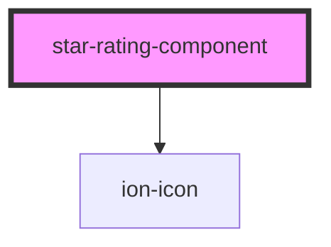

# star-rating-component

<!-- Auto Generated Below -->

## Properties

| Property   | Attribute  | Description                                                                               | Type                                                                     | Default         |
| ---------- | ---------- | ----------------------------------------------------------------------------------------- | ------------------------------------------------------------------------ | --------------- |
| `color`    | `color`    | Possible color for the stars. Options: danger, warning, success and info Default: warning | `Color.DANGER \| Color.INFO \| Color.SUCCESS \| Color.WARNING`           | `Color.WARNING` |
| `gap`      | `gap`      | The size of gutters, which is the space between one star and other star. Default: 1       | `Gap.DEFAULT \| Gap.EXTRA_SMALL \| Gap.LARGE \| Gap.MEDIUM \| Gap.SMALL` | `Gap.DEFAULT`   |
| `label`    | `label`    | Text to be displayed next to the stars. Default: null                                     | `string`                                                                 | `null`          |
| `rating`   | `rating`   | The actual star rating value. Default: 0                                                  | `number`                                                                 | `0`             |
| `readonly` | `readonly` | readOnly: boolean. The onClick callback is disabled. Default: false                       | `boolean`                                                                | `false`         |
| `size`     | `size`     | The size of the stars. Options: small, medium, large Default: medium                      | `Size.LARGE \| Size.MEDIUM \| Size.SMALL`                                | `Size.MEDIUM`   |
| `stars`    | `stars`    | Number of stars to display. Default: 5                                                    | `number`                                                                 | `5`             |
| `step`     | `step`     | The step interval of the stars. Default: 1                                                | `number`                                                                 | `1`             |

## Events

| Event          | Description | Type                                    |
| -------------- | ----------- | --------------------------------------- |
| `ratingChange` |             | `CustomEvent<number>`                   |
| `starClicked`  |             | `CustomEvent<Star & { star: number; }>` |

## Methods

### `setLabel(label: Label) => Promise<void>`

#### Returns

Type: `Promise<void>`

## Dependencies

### Depends on

- ion-icon

### Graph

----------------------------------------------

*Built with [StencilJS](https://stenciljs.com/)*
