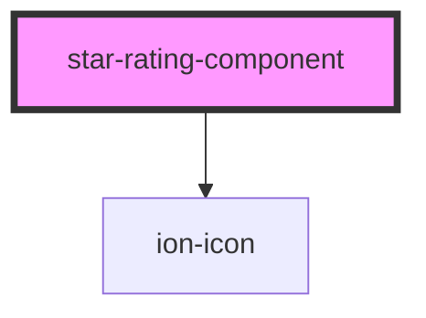

# star-rating-component

<!-- Auto Generated Below -->

## Properties

| Property | Attribute | Description                                                                               | Type                                                           | Default         |
| -------- | --------- | ----------------------------------------------------------------------------------------- | -------------------------------------------------------------- | --------------- |
| `color`  | `color`   | Possible color for the stars. Options: danger, warning, success and info Default: warning | `Color.DANGER \| Color.INFO \| Color.SUCCESS \| Color.WARNING` | `Color.WARNING` |
| `rating` | `rating`  | The actual star rating value. Default: 0                                                  | `number`                                                       | `0`             |
| `size`   | `size`    | The size of the stars. Options: small, medium, large Default: medium                      | `Size.LARGE \| Size.MEDIUM \| Size.SMALL`                      | `Size.MEDIUM`   |
| `stars`  | `stars`   | Number of stars to display. Default: 5                                                    | `number`                                                       | `5`             |

## Events

| Event          | Description | Type                  |
| -------------- | ----------- | --------------------- |
| `ratingChange` |             | `CustomEvent<number>` |

## Dependencies

### Depends on

- ion-icon

### Graph

----------------------------------------------

*Built with [StencilJS](https://stenciljs.com/)*
